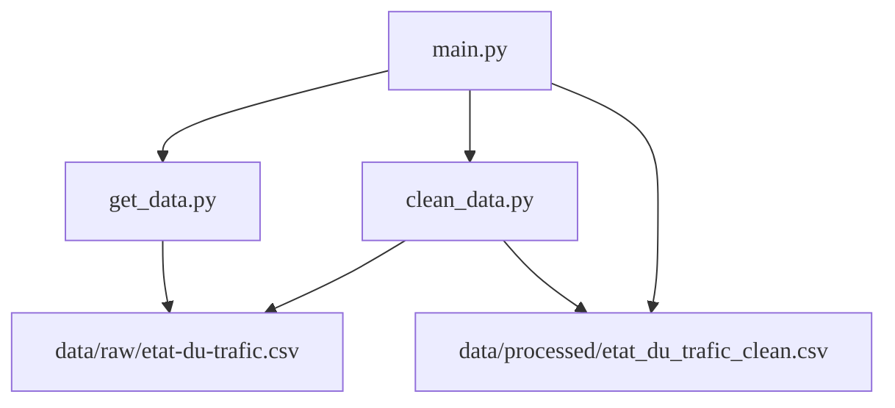
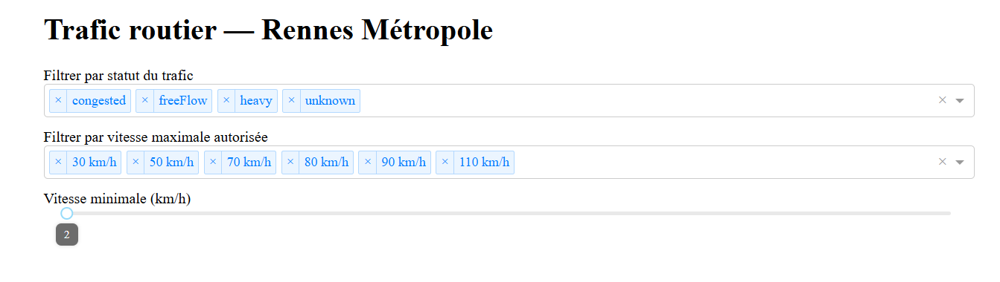
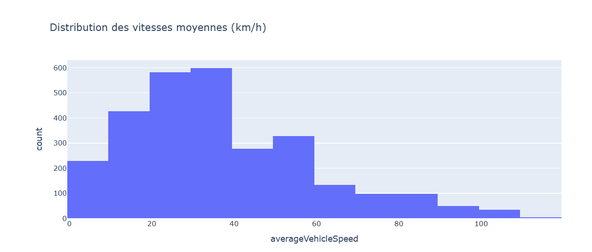
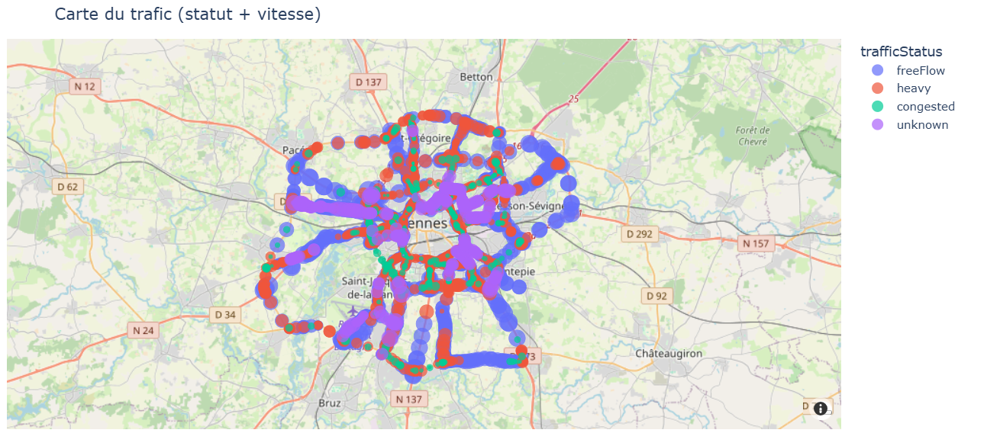

# DataProject
# Projet Data — Analyse du trafic routier à Rennes

## Objectif du projet
Ce projet a pour but d’analyser et de visualiser le **trafic routier sur Rennes Métropole**.  

L’application a été développée en **Python** avec le framework **Dash (Plotly)**, afin de construire un tableau de bord interactif permettant :
- d’explorer les vitesses moyennes des véhicules,  
- de filtrer par statut du trafic ou par vitesse,  
- et de visualiser la situation du trafic sur une carte.

## Structure du projet  <!-- Ajout : description de l'organisation des fichiers -->
Le projet est organisé de la manière suivante :

DataProject/

│-- main.py # Point d'entrée pour lancer le dashboard

│-- requirements.txt # Liste des packages nécessaires

│-- README.md # Ce fichier

│-- video.zip # contient une video de presentation du dashboard en .mp4

│-- data/ # Contient les données

│ ├─ raw/

│ └─ etat-du-trafic-en-temps-reel.csv # Données brutes téléchargées via get_data.py

│ ├─ processed/

│ └─ etat_du_trafic_clean.csv # Données nettoyées via clean_data.py

│-- images/ # Images utilisées dans le README

│-- utils/ # Fonctions utilitaires

│ ├─ get_data.py # Téléchargement des données Open Data

│ └─ clean_data.py # Nettoyage et préparation des données


## User Guide

### Lancer le projet

1. **Cloner le dépôt GitHub :**
   
   ```bash
   git clone https://github.com/yanis-nouili/DataProject.git
   cd DataProject
   ```

2. **Installer les dépendances :**
   ```bash
   pip install -r requirements.txt
   ```

3. **Télécharger les données brutes :**  <!-- Ajout : expliquer l'étape get_data -->
   ```bash
   python -c "from utils.get_data import get_data; get_data()"
   ```

4. **Nettoyer les données :** 
   ```bash
   python -c "from utils.clean_data import clean_data; clean_data()"
   ```
   Cela génère le fichier propre :
   `data/processed/etats_du_trafic_clean.csv`

5. **Lancer l’application Dash :**
```bash
   python main.py
   ```
Puis ouvrir le dash à l’adresse : http://127.0.0.1:8050/

Vous verrez une interface interactive avec :
- un histogramme des vitesses moyennes,
- une carte dynamique représentant le statut du trafic sur Rennes,
- plusieurs filtres : vitesse minimale, vitesse maximale, statut du trafic

## Data 
Les données proviennent de la plateforme [Open Data Rennes Métropole](https://www.data.gouv.fr/datasets/etat-du-trafic-en-temps-reel/).  
Elles contiennent des informations sur :
- la vitesse moyenne observée sur chaque tronçon routier,  
- le temps de parcours,  
- le statut du trafic (`freeFlow`, `heavy`, `congested`, `unknown`),  
- les coordonnées géographiques (`Geo Point`),  
- la vitesse maximale autorisée (`vitesse_maxi`),  
- ainsi que des informations de hiérarchie et de dénomination des routes.

### Préparation et nettoyage des données
Un premier travail de nettoyage a été effectué afin de rendre les données exploitables et de garder les plus nécessaires pour notre projet.

1. **Lecture du CSV brut** depuis `data/raw/`.
2. **Séparation** de la colonne `Geo Point` en deux colonnes distinctes `lat` et `lon`.
3. **Conversion** du champ `datetime` au format temporel.
4. **Suppression** des colonnes inutiles (informations administratives redondantes).
5. **Sauvegarde** du fichier nettoyé dans `data/processed/etat_du_trafic_clean.csv`.

Ce nettoyage est automatisé dans le script `utils/clean_data.py`.

### Ajout : Scripts utilitaires  <!-- Ajout : documentation sur get_data et clean_data -->
Le projet contient deux scripts utilitaires principaux :

- `get_data.py` : récupère les données depuis Open Data Rennes et les sauvegarde dans `data/raw/`.
- `clean_data.py` : nettoie les données téléchargées et les prépare pour le dashboard (création des colonnes `lat`, `lon`, conversion datetime, filtrage des colonnes).


## Developer Guide

Cette section décrit l’architecture générale du projet ainsi que les relations entre les différents fichiers Python.
Le code suit une approche impérative, avec un fichier principal (`main.py`) qui :
- charge les données nettoyées,
- initialise l'application Dash,
- construit l’interface utilisateur,
- met à jour les graphiques via des callbacks.

Les scripts du dossier utils/ fournissent des fonctionnalités séparées :
- `get_data.py` : télécharge le fichier de trafic et l’enregistre dans `data/raw/`,
- `clean_data.py` : lit les données brutes, applique les étapes de nettoyage, puis génère un fichier propre dans `data/processed/`.

Le schéma ci-dessous illustre cette architecture.


### Diagramme d’architecture




## Rapport d’analyse

### Observations principales:

- Les vitesses moyennes observées sont majoritairement comprises entre 20 et 40 km/h,
ce qui indique un trafic dense sur les axes urbains de Rennes.
- Les statuts `freeFlow` se concentrent sur les zones périphériques.
- La vitesse maximale autorisée la plus fréquente est de 50 km/h, correspondant aux zones urbaines principales.

### Filtres disponibles dans l’application

L’application Dash permet d’explorer les données grâce à plusieurs filtres interactifs :

**Statut du trafic** : Permet de sélectionner un ou plusieurs statuts parmi `freeFlow`, `heavy`, `congested`, `unknown`.  
**Vitesse minimale** : Filtre les tronçons dont la vitesse moyenne est **supérieure** à la valeur choisie.  
**Vitesse maximale autorisée** : Filtre les tronçons dont la vitesse limite est **inférieure** à la valeur choisie.

Chaque filtre met automatiquement à jour :
- l’**histogramme** des vitesses moyennes,
- la **carte interactive** représentant le trafic sur Rennes.


### Histogramme des vitesses moyennes
Cet histogramme montre la distribution des vitesses moyennes observées sur l’ensemble du réseau routier de Rennes.



### Carte du trafic à Rennes
La carte interactive permet de visualiser le trafic en fonction de son **statut** (`freeFlow`, `heavy`, `congested`, `unknown`) et de la **vitesse moyenne des véhicules**.

Chaque point représente un tronçon routier :
- La **couleur** indique le statut du trafic.
- La **taille** correspond à la vitesse moyenne.



## Vidéo de démonstration  <!-- Ajout : indiquer la vidéo -->
Une courte vidéo présentant l’interface et les fonctionnalités du dashboard est fournie dans `video.mp4`.

## Copyright

### get_data.py :

" raw_path.parent.mkdir(parents=True, exist_ok=True)  # création dossier si inexistant "

" if raw_path.exists():

   print(f"Fichier déjà présent : {raw_path}")
   
   return  "

" if response.status_code == 200:

   raw_path.write_bytes(response.content)  # sauvegarde du fichier
   
   print(f"Fichier téléchargé et sauvegardé : {raw_path}")
   
else:

   print(f"Erreur lors du téléchargement. Status code : {response.status_code}") "

### clean_data.py :

" cleaned_path.parent.mkdir(parents=True, exist_ok=True) "

" df_clean[["lat", "lon"]] = df_clean["Geo Point"].str.split(",", n=1, expand=True) "

### main.py :

" if not clean_path.exists():

   print("Fichier nettoyé introuvable")
   
   clean_data() "

" if "lat" not in df.columns or "lon" not in df.columns:

   df[["lat", "lon"]] = df["Geo Point"].str.split(",", n=1, expand=True)
   
   df["lat"] = df["lat"].astype(float)
   
   df["lon"] = df["lon"].astype(float) "

**Filtre “Statut du trafic”**:

"html.Div(

   [

      html.Label("Filtrer par statut du trafic"), # Label affiché

      dcc.Dropdown(

         id="status", # Identifiant du composant 

         options=[{"label": s, "value": s} for s in statuses], # Liste des choix

         value=statuses, # Valeurs sélectionnées par défaut

         multi=True, # Autorise plusieurs valeurs

      ),

   ],

   style={"marginBottom": "12px"},
   
),"

Nous avons ensuite réutilisé cette structure comme base pour développer les autres filtres de l'application


### README 

Nous nous sommes inspirés du site web donné dans le cours [GitLab Docs](https://docs.gitlab.com/user/markdown/#mermaid) pour le diagramme d'architecture :

"%%{init: { "fontFamily": "GitLab Sans" } }%%
graph TD

    accTitle: Architecture du projet DataProject
    accDescr: Diagramme montrant les relations entre main.py, clean_data.py, get_data.py et les fichiers CSV.

    A[main.py] --> B[clean_data.py];
    A --> C[get_data.py];

    C --> R[data/raw/etat-du-trafic.csv];
    B --> R;

    B --> P[data/processed/etat_du_trafic_clean.csv];
    A --> P; "


### Pour chacune des lignes de code ne nous appartenant pas, seul ChatGPT a été utilisé

Toute ligne non déclarée ci dessus est réputée être produite par l’auteur (ou les auteurs) du projet. L’absence ou l’omission de déclaration sera considéré comme du plagiat.

